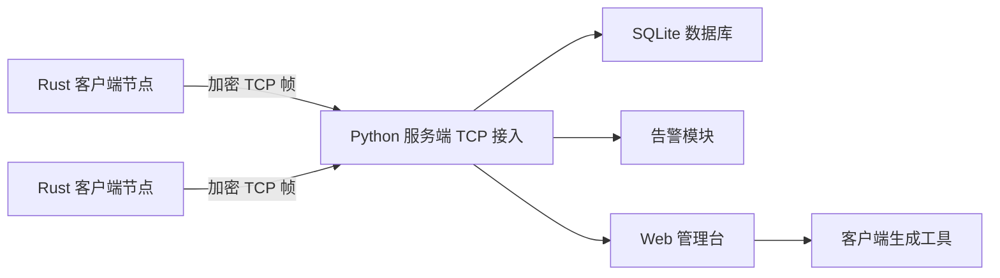

# 系统设计文档

## 1. 目标

本项目实现一套 CS 架构的轻量低交互端口蜜罐。客户端部署在目标主机上伪装敏感端口，捕获扫描和探测行为；服务端统一接收日志、管理节点、存储事件并触发告警。

## 2. 总体架构



## 3. 客户端设计

客户端位于 `client/`，采用 Rust 开发，目标是编译后单文件运行。

核心模块：

- 配置加载：优先读取运行目录 `client_config.json`，否则使用编译时内置 `config/default_client.json`。
- 端口监听：普通模式下对多个端口启动独立 TCP 监听线程，完成握手后最多读取 1KB 内容并主动断开。
- 本地日志：所有运行状态、错误和访问事件写入 `logs/client.log`。
- 断线补发：访问事件以 JSONL 形式写入 `data/client_spool.jsonl`，连接恢复后批量加密上传并清空。
- 心跳保活：周期上报节点 ID、系统、架构、监听端口等状态。
- 隐身模式：Linux PoC 已通过 raw TCP socket 捕获 SYN 包，并通过 `scripts/linux_stealth_setup.sh` 配置 iptables/nftables 阻断 RST。Windows 生产级隐身模式需要 WinDivert/NDIS 后端。

## 4. 服务端设计

服务端位于 `server/porthoneypot/`，只使用 Python 标准库。

核心模块：

- `tcp_service.py`：多线程 TCP 接入服务，处理注册、心跳、事件上传。
- `crypto.py`：认证加密帧，使用 HMAC-SHA256 派生密钥、生成流式密钥和完整性标签。
- `database.py`：SQLite 存储节点、攻击事件、服务端日志、告警历史。攻击内容字段二次加密后入库。
- `alerts.py`：本地声音、SMTP 邮件、钉钉、飞书、企业微信告警，支持频率限制。
- `web_service.py`：内置 Web 管理台，提供节点、日志、统计、服务启停、告警测试和客户端生成。
- `client_builder.py`：生成离线客户端配置包，包含内置配置、源码和可选预编译二进制。
- `update_manager.py`：管理离线客户端更新包，生成 manifest，提供下载接口。

节点控制：

- 服务端通过 `node_commands` 表保存待下发命令。
- 客户端每次心跳都会拉取 pending 命令。
- 已实现命令包括 `start_all`、`stop_all`、`set_ports`。
- `set_ports` 会让客户端停止被移除端口的监听，并启动新增端口监听，满足端口批量修改实时生效。

## 5. 通信协议

所有客户端与服务端通信均采用 TCP 长连接。

帧格式：

```text
uint32_be encrypted_frame_length
encrypted_frame
```

加密帧格式：

```text
magic("PHP1") || nonce(16 bytes) || ciphertext || hmac_tag(32 bytes)
```

消息体为 UTF-8 JSON。

主要消息：

- `register`：节点首次连接，上传节点 ID、主机名、系统、架构、监听端口。
- `heartbeat`：周期心跳，刷新在线状态。
- `events`：批量上传攻击事件。
- `status_log`：上传客户端运行日志。

## 6. 数据库设计

主要表：

- `nodes`：节点状态、IP、系统、监听端口、最后心跳。
- `attack_events`：攻击时间、源 IP、源端口、目标端口、模式、加密内容。
- `server_logs`：服务端运行日志。
- `alert_history`：告警历史与去重限频。
- `node_commands`：节点命令队列，用于服务端远程控制客户端端口和监听状态。

## 7. 告警设计

告警事件包括：

- 节点被访问。
- 节点断连。
- 异常端口探测。

告警通道包括：

- 本地声音提示。
- SMTP 邮件。
- 钉钉群机器人，支持加签。
- 飞书群机器人。
- 企业微信群机器人。

限频策略按 `event_type + dedupe_key` 记录最近告警时间，避免短时间内大量重复通知。

## 8. 自动更新设计

自动更新采用内网离线发布模式：

- 管理端将预编译客户端二进制发布到 `data/updates/<platform>/`。
- 服务端写入 `manifest.json`，包含版本、文件名、大小、SHA256 和下载路径。
- 客户端定期请求 manifest，只接受版本号高于自身的更新。
- 下载完成后校验大小和 SHA256。
- Windows 客户端通过临时 PowerShell 脚本等待当前进程退出，覆盖原二进制并重新启动。

该设计不依赖公网更新服务，适合实训内网环境。

## 9. 跨平台策略

- 服务端：Python 标准库 + SQLite，Windows/Linux/macOS 均可运行。
- 客户端：Rust release 构建启用 LTO 和 strip，目标为单二进制部署。
- Windows 托盘、自启动与隐身捕获属于平台 API 能力，当前项目保留模块边界和部署说明，实际生产可接入 Shell_NotifyIcon、注册表启动项、WinDivert/NDIS 后端。
- Linux 信创环境可通过 systemd 自启动、nftables/iptables 阻断 RST、raw socket 捕获 SYN。Linux 隐身模式 PoC 已具备真实捕获链路。

## 10. 安全边界

本项目用于企业实训和防御侧诱捕验证。客户端默认只记录连接元数据和最多 1KB 访问片段；服务端内容字段加密入库。共享密钥必须通过可信渠道分发，不应提交到公开仓库。
